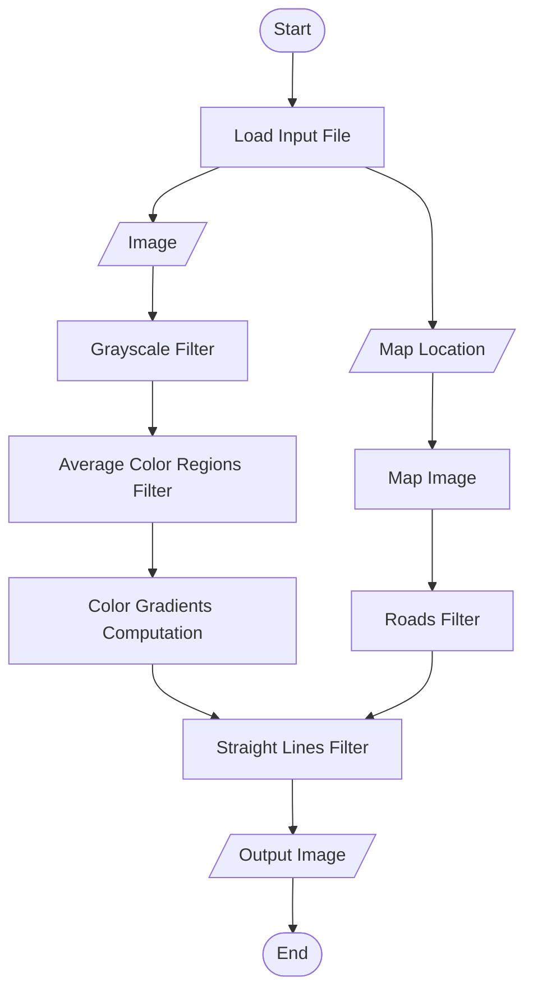

# PicColGrad-RoadMapLoc

## Intro

This is my first Rust project!

PicColGrad-RoadMapLoc translates to: Picture Color Gradient and Road Map
Location Image Processor. This is a program that gets an image and a map
location, generating an image resulting from the merge of the map location
roads drawing and a custom image processing based on local color gradients.

Ok, wow... Maybe it will become more understandable once there's a sample
output.

## Motivation

I just had this idea to make a new profile pic using some coding.

## Code Structure

Here's a flowchart to aid in the implementation of the code:

