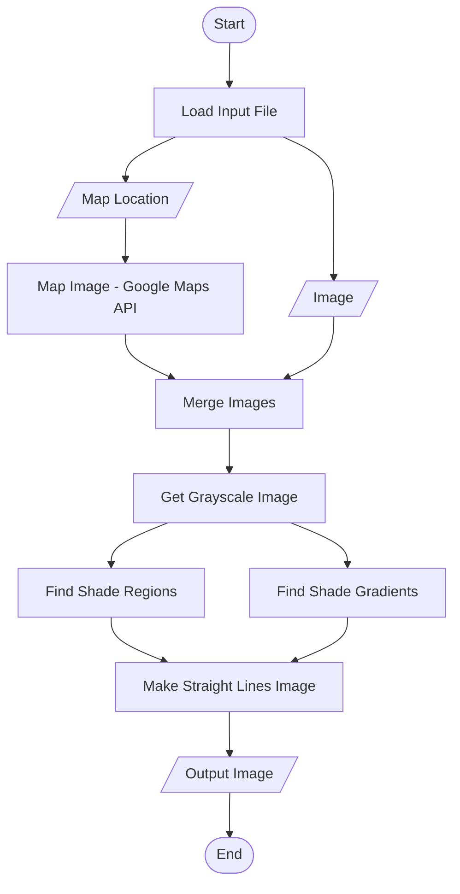

# Algorithms

This doc details the different algorithms as flowcharts.

## Global Algorithm

Here's the global algorithm:

## Map Image

TO DO

## Merge Images

TO DO

## Grayscale Image Algorithm

Uses image crate's into_luma_alpha8 function.

## Shade Regions Determination Algorithm

Here's the algorithm to find the shade regions as a flowchart:

## Shade Gradients Algorithm

TO DO (already implemented)

## Straight Lines Image Algorithm

TO DO